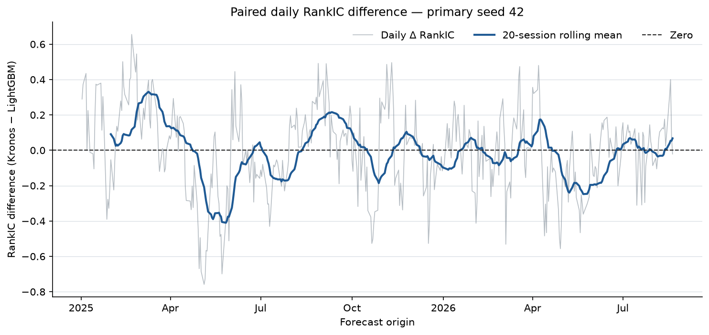
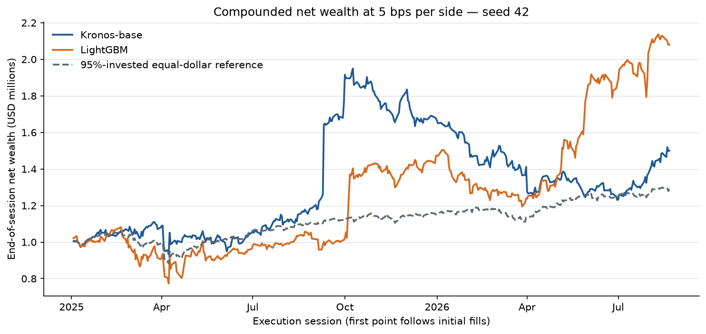

# Leonos v1 results

Primary seed: 42. Test span: 2025-01-03 through 2026-08-21 (signals trade at the next session open). Costs are 5 bps per side; cash return is zero.

The ranking evidence is inconclusive because the paired 95% interval contains zero: mean daily RankIC difference (Kronos − LightGBM) was -0.0056 with paired moving-block 95% CI [-0.0746, 0.0496] across 409 dates. LightGBM also produced the higher 5-bps net return.

| Model | Coverage | Mean RankIC | Paired Δ RankIC (95% CI) | MAE (bp) | Net return | CAGR | Net Sharpe | Max drawdown | Σ daily turnover rate | Costs | Inference seconds | Peak GPU allocated | Peak GPU reserved |
| --- | ---: | ---: | ---: | ---: | ---: | ---: | ---: | ---: | ---: | ---: | ---: | ---: | ---: |
| kronos | 100.00% | -0.0032 | -0.0056 [-0.0746, 0.0496] | 403.7 | 49.99% | 28.37% | 0.84 | -36.91% | 72.40 | $47,777 | 862.0 | 1.19 GiB | 3.67 GiB |
| lightgbm | 100.00% | 0.0025 | reference | 290.6 | 107.99% | 57.02% | 1.23 | -28.59% | 66.42 | $43,033 | 0.028 | NA | NA |

The zero-score reference has RankIC `NA` and MAE 292.1 bp. The 95%-invested equal-weight buy-and-hold reference returned 28.99% net, with Sharpe 1.20, CAGR 16.98%, and maximum drawdown -16.36%.

## Figures

## Seed and period stability

All three declared-seed RankIC differences are negative, but each paired 95% CI contains zero; ranking evidence is not robust proof of a difference.

The 5-bps portfolio winner is not seed-stable: LightGBM wins seeds 42 and 43; Kronos narrowly wins seed 44.

The primary-seed calendar-year RankIC difference changes sign (positive in 2025; negative in 2026).

| Seed | Kronos RankIC | LightGBM RankIC | Δ RankIC (K−L) | Paired 95% CI | Kronos net, 5 bps | LightGBM net, 5 bps | Portfolio winner (margin) |
| ---: | ---: | ---: | ---: | ---: | ---: | ---: | --- |
| 42 | -0.0032 | 0.0025 | -0.0056 | [-0.0746, 0.0496] | 49.99% | 107.99% | LightGBM (+58.00 pp) |
| 43 | -0.0035 | 0.0001 | -0.0036 | [-0.0656, 0.0462] | 35.02% | 126.09% | LightGBM (+91.07 pp) |
| 44 | -0.0020 | 0.0069 | -0.0089 | [-0.0774, 0.0474] | 53.98% | 51.42% | Kronos (+2.56 pp) |

Primary-seed calendar-year RankIC:

| Year | Dates | Kronos RankIC | LightGBM RankIC | Δ RankIC (K−L) |
| ---: | ---: | ---: | ---: | ---: |
| 2025 | 250 | 0.0008 | -0.0044 | 0.0052 |
| 2026 | 159 | -0.0094 | 0.0133 | -0.0227 |

## Sensitivities

| Model | Net return, 0 bps | Net return, 5 bps | Net return, 15 bps |
| --- | ---: | ---: | ---: |
| kronos | 55.86% | 49.99% | 39.03% |
| lightgbm | 114.89% | 107.99% | 95.08% |

| Bootstrap block (sessions) | Mean Δ RankIC | 95% CI lower | 95% CI upper |
| ---: | ---: | ---: | ---: |
| 10 | -0.0056 | -0.0649 | 0.0449 |
| 20 | -0.0056 | -0.0746 | 0.0496 |
| 40 | -0.0056 | -0.0820 | 0.0534 |

## Worked accounting example

The kronos strategy selected **UNH** from the 2025-01-02 post-close signal and bought 375 shares at the next open on 2025-01-03 for $506.3500. Its 2025-01-10 exit signal filled at the 2025-01-13 open for $535.0400: gross result $10,758.74, fees $195.26, and net result $10,563.48. This deterministic accounting example is not evidence of model skill and is not a forced final liquidation.

Remaining positions are marked at the last close and are not forcibly liquidated.

## Limits

This is a finite test on a fixed surviving-stock basket using a present-day historical snapshot, not a point-in-time universe. The checkpoint's June 2024 pretraining cutoff is author-reported rather than independently audited. Kronos and LightGBM differ in architecture and training history, so this does not isolate pretraining causally. The portfolio is a split-adjusted price-return simulation, not literal historical share accounting; dividends are excluded. Daily next-open fills and fixed proportional costs simplify execution and say nothing about live fill quality or capacity.
